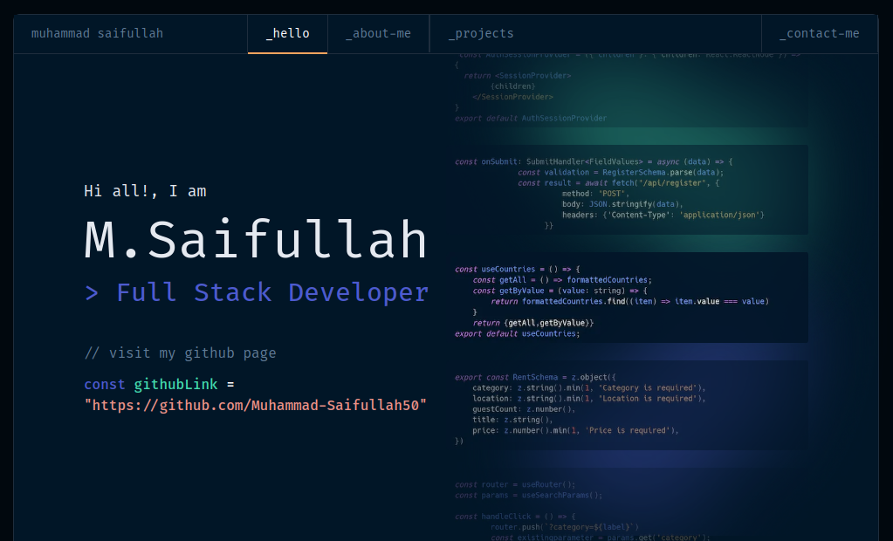

# 
 Muhammad Saifullah

# 
🚀 Full Stack Next.js Developer 🎉 

Hey there! 👋 I'm Muhammad Saifullah, a Full Stack Developer enthusiastic to build modern software 🌟.

## 🛠️ Tech Toolbox

In my coding toolkit, you'll find:

- **Frontend:**
       

- **Backend:** 
 

- **Databases:** 

## 🌐 Dive into My Digital Universe

Explore my evolving portfolio by clicking on the image below  

## 💻 Excited to Connect!

Feel free to explore or share your thoughts on any of my projects. If you're as passionate about tech as I am, let's chat on [Twitter](https://twitter.com/yourhandle) or connect on [LinkedIn](https://www.linkedin.com/in/yourprofile).

Cheers to coding brilliance and endless possibilities! 🌈🚀
