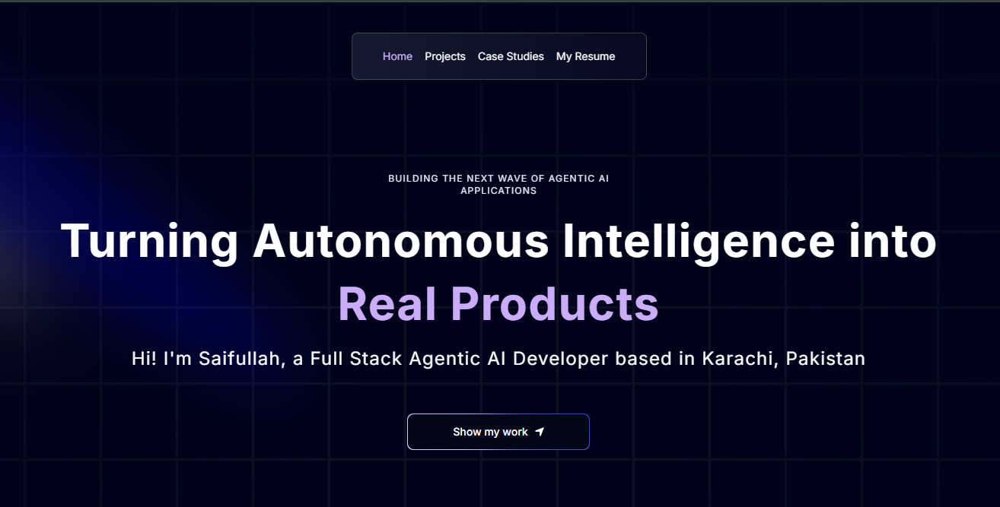

# 
Muhammad Saifullah

# 
🔮Agentic AI Developer

Hey! I'm Saifullah — an AI student at SSUET and currently pursuing CAARE (Certified Agentic AI and Robotics Engineer) at PIAIC.

For the past year I've been going deep into agentic AI — how these systems actually work, how to build them, and how to use them as part of my development workflow.

## 🛠️ What I Work With

**Agentic AI:**

**Full Stack:**

## 🔨 Currently Building

AI-powered agentic and autonomous applications — PIAIC hackathon projects and personal builds.

## 🤝 Let's Connect

## 🌐 Portfolio

